<picture>
  <source media="(prefers-color-scheme: dark)" srcset="./assets/hero-dark.svg">
  <source media="(prefers-color-scheme: light)" srcset="./assets/hero-light.svg">
  
</picture>

**AI systems · agentic workflows · backend engineering · deployment**

 

<picture>
  <source media="(prefers-color-scheme: dark)" srcset="./assets/projects-dark.svg">
  <source media="(prefers-color-scheme: light)" srcset="./assets/projects-light.svg">
  
</picture>

[Distributed Messaging](https://github.com/aruns-ue25/DS-Messaging-System) ·
[CalTrack](https://github.com/MohamedIlzam/CalTrack) ·
[Kodikara BMS](https://github.com/MohamedIlzam/Bakery-Management-System-Project) ·
[Skill Share](https://github.com/aruns-ue25/Skill-Share)

