  

<b>⚡ 01 &nbsp;|&nbsp; Core Engineering Ecosystem &amp; Tech Stack</b>

 

#### 🧠 Intelligent Systems & Agentic AI

#### ⚙️ Event Streaming & Distributed Systems

#### 🏛️ Enterprise Backend Frameworks

#### 💾 Databases & Data Infrastructure

#### 🛡️ DevOps, CI/CD & Test Automation

---

<b>🏗️ 02 &nbsp;|&nbsp; Featured Systems &amp; Production Architecture</b>

 

| System | Architecture & Engineering Focus | Core Stack | Repository |
| :--- | :--- | :--- | :---: |
| **Distributed Messaging Cluster** | Fault-tolerant 3-node cluster with **quorum consensus replication**, two-tiered storage (LRU cache + SQL), idempotent writes, and **active read repair**. | `Java` · `MySQL` · `HikariCP` | [Code →](https://github.com/aruns-ue25/DS-Messaging-System) |
| **Event-Driven Client Lifecycle Platform** | Scalable enterprise architecture with **asynchronous Kafka event streaming**, microservice workflows, and decoupled message ingestion. | `.NET 8` · `C#` · `Kafka` · `PostgreSQL` | *(Active Project)* |
| **CalTrack** | Mobile-first nutrition platform with an **AI chat coach grounded in activity data via vector retrieval**, multi-tier Redis caching, and relational integrity. | `Next.js` · `NestJS` · `pgvector` · `Prisma` · `Redis` | [Code →](https://github.com/MohamedIlzam/CalTrack) |
| **Kodikara BMS** | Containerized enterprise ERP with DTO mapping, transactional integrity, operational workflows, and **automated Cypress E2E test suites** in CI. | `Spring Boot` · `React` · `MySQL` · `Docker` · `Cypress` | [Code →](https://github.com/MohamedIlzam/Bakery-Management-System-Project) |
| **Skill Share** | Composable P2P platform featuring a **dynamic multi-criteria search engine** built on Spring Data JPA Specifications and structured service layers. | `Java` · `Spring Boot` · `JPA` · `MySQL` | [Code →](https://github.com/aruns-ue25/Skill-Share) |
| **TaskLang++** | Custom Domain-Specific Language (DSL) designed for **deterministic task scheduling, pipeline orchestration, and automation**. | `C` · `Lex/Yacc` · `Automation` | [Code →](https://github.com/MohamedIlzam/TaskLang-Assignment) |

---

<b>🔍 03 &nbsp;|&nbsp; Architectural Highlights &amp; Engineering Focus</b>

 

* **Event-Driven Streaming & Decoupling**: Designing asynchronous pipelines with **Apache Kafka**, partition management, and reliable consumer state.
* **Consensus & Fault Tolerance**: Implementing distributed replication models with **Quorum Consensus**, anti-entropy recovery, and self-healing read repair.
* **Vector Retrieval & Agentic Context**: Integrating **pgvector**, embeddings, and custom tool calling to ground LLM reasoning in verified domain context.
* **Production Reliability**: Backing code with **Cypress automated E2E test suites**, containerized Docker workflows, and GitHub Actions CI delivery.

  

**Build intelligent systems. Understand the infrastructure beneath them.**

