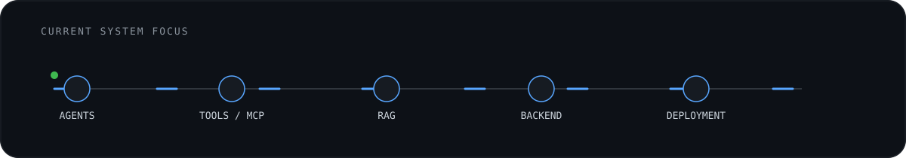

<picture>
  <source media="(prefers-color-scheme: dark)" srcset="./assets/hero-dark.svg">
  <source media="(prefers-color-scheme: light)" srcset="./assets/hero-light.svg">
  
</picture>

I build **AI-enabled backend systems** that combine agentic workflows, retrieval, distributed services, and production infrastructure. My current focus is moving beyond isolated LLM features toward systems that can **retrieve context, use tools, maintain state, and operate reliably in production**.

---

## Selected Systems

### 🔗 Distributed Messaging System
`Java` `MySQL` `HikariCP`

Fault-tolerant cluster with **tiered LRU/SQL storage, quorum consensus replication, active read repair, and idempotent writes**.

[View repository →](https://github.com/aruns-ue25/DS-Messaging-System)

### 🔥 CalTrack
`Next.js` `NestJS` `PostgreSQL` `pgvector` `Prisma` `Redis`

Mobile-first fitness platform with an **AI coach grounded in user activity data**, backed by Redis caching and vector-enabled PostgreSQL.

[View repository →](https://github.com/MohamedIlzam/CalTrack)

### 🍞 Kodikara BMS
`Java` `Spring Boot` `React` `MySQL` `Docker` `Cypress`

Containerized enterprise management platform covering operational workflows, sales distribution, payments, reporting, and automated E2E testing.

[View repository →](https://github.com/MohamedIlzam/Bakery-Management-System-Project)

### 🤝 Skill Share
`Java` `Spring Boot` `JPA`

P2P skill exchange system with **dynamic multi-criteria search using JPA Specifications** and a structured backend architecture.

[View repository →](https://github.com/aruns-ue25/Skill-Share)

---

<picture>
  <source media="(prefers-color-scheme: dark)" srcset="./assets/systems-dark.svg">
  <source media="(prefers-color-scheme: light)" srcset="./assets/systems-light.svg">
  
</picture>

## Engineering Stack

**AI / Intelligent Systems**  
`LLMs` · `RAG` · `Agents` · `MCP` · `Vector Search`

**Backend**  
`Java` · `Spring Boot` · `Python` · `NestJS` · `Prisma`

**Data**  
`PostgreSQL` · `pgvector` · `MySQL` · `Redis`

**Infrastructure**  
`Docker` · `Linux` · `CI/CD`

**Frontend**  
`TypeScript` · `React` · `Next.js`

---

## Currently Exploring

- agent orchestration
- tool-use and MCP architectures
- retrieval + memory systems
- AI evaluation and observability
- production AI infrastructure
- DevOps and deployment automation

**Build intelligent systems. Understand the infrastructure beneath them.**

