<picture>
  <source media="(prefers-color-scheme: dark)" srcset="./assets/hero-dark.svg">
  <source media="(prefers-color-scheme: light)" srcset="./assets/hero-light.svg">
  
</picture>

I build **AI systems** that combine **agents, retrieval, backend architecture, and deployment infrastructure**.

 

<picture>
  <source media="(prefers-color-scheme: dark)" srcset="./assets/featured-dark.svg">
  <source media="(prefers-color-scheme: light)" srcset="./assets/featured-light.svg">
  
</picture>
